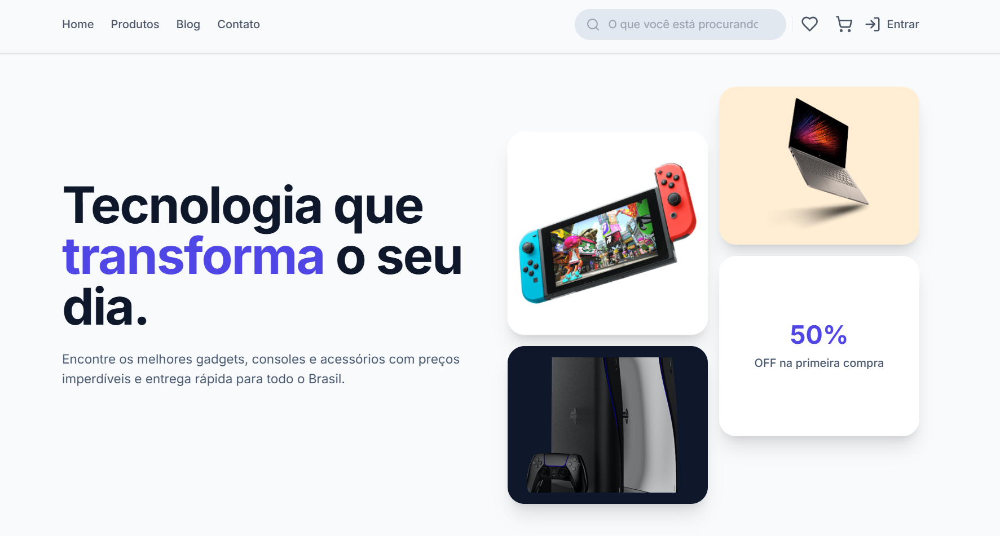
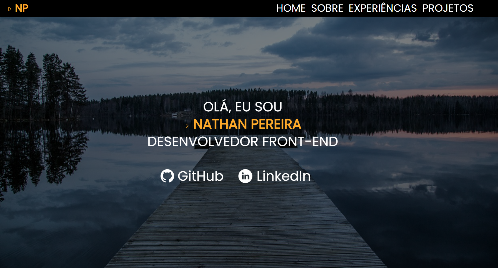
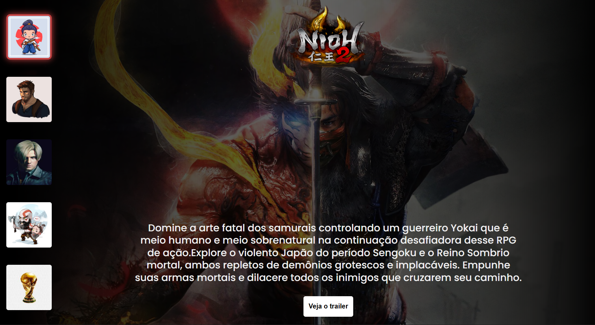
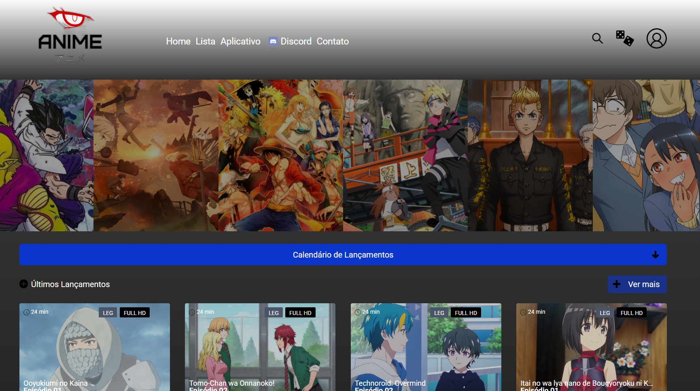

# 👨🏻‍💻 Nathan Pereira

**`Desenvolvedor Front-End | Figma-to-code`**

Olá👋🏻! Me chamo Nathan Pereira, tenho 20 anos e sou apaixonado em transformar café em código, resolver bugs e até suprir necessidades da vida real com as linhas codificadas. Atualmente, estou cursando Análise e Desenvolvimento de Sistemas na Uniube, focado em criar experiências incríveis no Front-End e mergular de cabeça em suas principais tecnologias.

---

### 🤖 Linguagens e Tecnologias

 
 

---

### 📱Contato

 
  
   

---

### 🚀 Meus Projetos

  <table>
    <tr>
      <td align="center" width="400">
        <a href="https://github.com/NathanDSPereira/E-commerce-angular">
          
          <b>🛒 E-commerce Angular</b> 
          

            
            
            
          

        </a>
      </td>
      <td align="center" width="400">
        <a href="https://nathandspereira.github.io/portfolio/">
           
          <b>🎨 Portfólio</b> 
          

            
            
          

        </a>
      </td>
    </tr>
    <tr>
      <td align="center" width="400">
        <a href="https://nathandspereira.github.io/exemplares-jogos/">
           
          <b>🎮 Exibição Jogos</b> 
           

            
            
            
          

        </a>
      </td>
      <td align="center" width="400">
        <a href="https://nathandspereira.github.io/pagina-inicial-site-anime/">
           
          <b>🥋 Exibição Animes</b> 
          

            
            
          

        </a>
      </td>
    </tr>
  </table>

